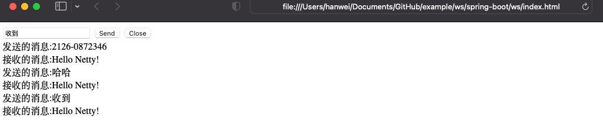

# 工程简介
启动java的main方法后，浏览器打开打开项目目录下的 index.html

    /Library/Java/JavaVirtualMachines/zulu-8.jdk/Contents/Home/bin/java -XX:TieredStopAtLevel=1 -noverify -Dspring.output.ansi.enabled=always -javaagent:/Applications/IntelliJ IDEA.app/Contents/lib/idea_rt.jar=54365:/Applications/IntelliJ IDEA.app/Contents/bin -Dcom.sun.management.jmxremote -Dspring.jmx.enabled=true -Dspring.liveBeansView.mbeanDomain -Dspring.application.admin.enabled=true -Dfile.encoding=UTF-8 -classpath /Library/Java/JavaVirtualMachines/zulu-8.jdk/Contents/Home/jre/lib/charsets.jar:/Library/Java/JavaVirtualMachines/zulu-8.jdk/Contents/Home/jre/lib/crs-agent.jar:/Library/Java/JavaVirtualMachines/zulu-8.jdk/Contents/Home/jre/lib/ext/cldrdata.jar:/Library/Java/JavaVirtualMachines/zulu-8.jdk/Contents/Home/jre/lib/ext/dnsns.jar:/Library/Java/JavaVirtualMachines/zulu-8.jdk/Contents/Home/jre/lib/ext/jaccess.jar:/Library/Java/JavaVirtualMachines/zulu-8.jdk/Contents/Home/jre/lib/ext/legacy8ujsse.jar:/Library/Java/JavaVirtualMachines/zulu-8.jdk/Contents/Home/jre/lib/ext/localedata.jar:/Library/Java/JavaVirtualMachines/zulu-8.jdk/Contents/Home/jre/lib/ext/nashorn.jar:/Library/Java/JavaVirtualMachines/zulu-8.jdk/Contents/Home/jre/lib/ext/openjsse.jar:/Library/Java/JavaVirtualMachines/zulu-8.jdk/Contents/Home/jre/lib/ext/sunec.jar:/Library/Java/JavaVirtualMachines/zulu-8.jdk/Contents/Home/jre/lib/ext/sunjce_provider.jar:/Library/Java/JavaVirtualMachines/zulu-8.jdk/Contents/Home/jre/lib/ext/sunpkcs11.jar:/Library/Java/JavaVirtualMachines/zulu-8.jdk/Contents/Home/jre/lib/ext/zipfs.jar:/Library/Java/JavaVirtualMachines/zulu-8.jdk/Contents/Home/jre/lib/jce.jar:/Library/Java/JavaVirtualMachines/zulu-8.jdk/Contents/Home/jre/lib/jfr.jar:/Library/Java/JavaVirtualMachines/zulu-8.jdk/Contents/Home/jre/lib/jsse.jar:/Library/Java/JavaVirtualMachines/zulu-8.jdk/Contents/Home/jre/lib/management-agent.jar:/Library/Java/JavaVirtualMachines/zulu-8.jdk/Contents/Home/jre/lib/resources.jar:/Library/Java/JavaVirtualMachines/zulu-8.jdk/Contents/Home/jre/lib/rt.jar:/Library/Java/JavaVirtualMachines/zulu-8.jdk/Contents/Home/lib/dt.jar:/Library/Java/JavaVirtualMachines/zulu-8.jdk/Contents/Home/lib/jconsole.jar:/Library/Java/JavaVirtualMachines/zulu-8.jdk/Contents/Home/lib/tools.jar:/Users/hanwei/Documents/GitHub/example/ws/spring-boot/ws/target/classes:/Users/hanwei/.m2/repository/org/springframework/boot/spring-boot-starter-web/2.3.7.RELEASE/spring-boot-starter-web-2.3.7.RELEASE.jar:/Users/hanwei/.m2/repository/org/springframework/boot/spring-boot-starter/2.3.7.RELEASE/spring-boot-starter-2.3.7.RELEASE.jar:/Users/hanwei/.m2/repository/org/springframework/boot/spring-boot/2.3.7.RELEASE/spring-boot-2.3.7.RELEASE.jar:/Users/hanwei/.m2/repository/org/springframework/boot/spring-boot-autoconfigure/2.3.7.RELEASE/spring-boot-autoconfigure-2.3.7.RELEASE.jar:/Users/hanwei/.m2/repository/org/springframework/boot/spring-boot-starter-logging/2.3.7.RELEASE/spring-boot-starter-logging-2.3.7.RELEASE.jar:/Users/hanwei/.m2/repository/ch/qos/logback/logback-classic/1.2.3/logback-classic-1.2.3.jar:/Users/hanwei/.m2/repository/ch/qos/logback/logback-core/1.2.3/logback-core-1.2.3.jar:/Users/hanwei/.m2/repository/org/apache/logging/log4j/log4j-to-slf4j/2.13.3/log4j-to-slf4j-2.13.3.jar:/Users/hanwei/.m2/repository/org/apache/logging/log4j/log4j-api/2.13.3/log4j-api-2.13.3.jar:/Users/hanwei/.m2/repository/org/slf4j/jul-to-slf4j/1.7.30/jul-to-slf4j-1.7.30.jar:/Users/hanwei/.m2/repository/jakarta/annotation/jakarta.annotation-api/1.3.5/jakarta.annotation-api-1.3.5.jar:/Users/hanwei/.m2/repository/org/yaml/snakeyaml/1.26/snakeyaml-1.26.jar:/Users/hanwei/.m2/repository/org/springframework/boot/spring-boot-starter-json/2.3.7.RELEASE/spring-boot-starter-json-2.3.7.RELEASE.jar:/Users/hanwei/.m2/repository/com/fasterxml/jackson/core/jackson-databind/2.11.3/jackson-databind-2.11.3.jar:/Users/hanwei/.m2/repository/com/fasterxml/jackson/core/jackson-annotations/2.11.3/jackson-annotations-2.11.3.jar:/Users/hanwei/.m2/repository/com/fasterxml/jackson/core/jackson-core/2.11.3/jackson-core-2.11.3.jar:/Users/hanwei/.m2/repository/com/fasterxml/jackson/datatype/jackson-datatype-jdk8/2.11.3/jackson-datatype-jdk8-2.11.3.jar:/Users/hanwei/.m2/repository/com/fasterxml/jackson/datatype/jackson-datatype-jsr310/2.11.3/jackson-datatype-jsr310-2.11.3.jar:/Users/hanwei/.m2/repository/com/fasterxml/jackson/module/jackson-module-parameter-names/2.11.3/jackson-module-parameter-names-2.11.3.jar:/Users/hanwei/.m2/repository/org/springframework/boot/spring-boot-starter-tomcat/2.3.7.RELEASE/spring-boot-starter-tomcat-2.3.7.RELEASE.jar:/Users/hanwei/.m2/repository/org/apache/tomcat/embed/tomcat-embed-core/9.0.41/tomcat-embed-core-9.0.41.jar:/Users/hanwei/.m2/repository/org/glassfish/jakarta.el/3.0.3/jakarta.el-3.0.3.jar:/Users/hanwei/.m2/repository/org/apache/tomcat/embed/tomcat-embed-websocket/9.0.41/tomcat-embed-websocket-9.0.41.jar:/Users/hanwei/.m2/repository/org/springframework/spring-web/5.2.12.RELEASE/spring-web-5.2.12.RELEASE.jar:/Users/hanwei/.m2/repository/org/springframework/spring-beans/5.2.12.RELEASE/spring-beans-5.2.12.RELEASE.jar:/Users/hanwei/.m2/repository/org/springframework/spring-webmvc/5.2.12.RELEASE/spring-webmvc-5.2.12.RELEASE.jar:/Users/hanwei/.m2/repository/org/springframework/spring-aop/5.2.12.RELEASE/spring-aop-5.2.12.RELEASE.jar:/Users/hanwei/.m2/repository/org/springframework/spring-context/5.2.12.RELEASE/spring-context-5.2.12.RELEASE.jar:/Users/hanwei/.m2/repository/org/springframework/spring-expression/5.2.12.RELEASE/spring-expression-5.2.12.RELEASE.jar:/Users/hanwei/.m2/repository/org/yeauty/netty-websocket-spring-boot-starter/0.10.0/netty-websocket-spring-boot-starter-0.10.0.jar:/Users/hanwei/.m2/repository/io/netty/netty-codec-http/4.1.55.Final/netty-codec-http-4.1.55.Final.jar:/Users/hanwei/.m2/repository/io/netty/netty-common/4.1.55.Final/netty-common-4.1.55.Final.jar:/Users/hanwei/.m2/repository/io/netty/netty-buffer/4.1.55.Final/netty-buffer-4.1.55.Final.jar:/Users/hanwei/.m2/repository/io/netty/netty-transport/4.1.55.Final/netty-transport-4.1.55.Final.jar:/Users/hanwei/.m2/repository/io/netty/netty-codec/4.1.55.Final/netty-codec-4.1.55.Final.jar:/Users/hanwei/.m2/repository/io/netty/netty-handler/4.1.55.Final/netty-handler-4.1.55.Final.jar:/Users/hanwei/.m2/repository/io/netty/netty-resolver/4.1.55.Final/netty-resolver-4.1.55.Final.jar:/Users/hanwei/.m2/repository/org/slf4j/slf4j-api/1.7.30/slf4j-api-1.7.30.jar:/Users/hanwei/.m2/repository/org/springframework/spring-core/5.2.12.RELEASE/spring-core-5.2.12.RELEASE.jar:/Users/hanwei/.m2/repository/org/springframework/spring-jcl/5.2.12.RELEASE/spring-jcl-5.2.12.RELEASE.jar com.example.ws.WsApplication
    
    .   ____          _            __ _ _
    /\\ / ___'_ __ _ _(_)_ __  __ _ \ \ \ \
    ( ( )\___ | '_ | '_| | '_ \/ _` | \ \ \ \
    \\/  ___)| |_)| | | | | || (_| |  ) ) ) )
    '  |____| .__|_| |_|_| |_\__, | / / / /
    =========|_|==============|___/=/_/_/_/
    :: Spring Boot ::        (v2.3.7.RELEASE)
    
    2022-03-25 20:36:49.180  INFO 26168 --- [           main] com.example.ws.WsApplication             : Starting WsApplication on hanweideMacBook-Air.local with PID 26168 (/Users/hanwei/Documents/GitHub/example/ws/spring-boot/ws/target/classes started by hanwei in /Users/hanwei/Documents/GitHub/example/ws/spring-boot/ws)
    2022-03-25 20:36:49.182  INFO 26168 --- [           main] com.example.ws.WsApplication             : No active profile set, falling back to default profiles: default
    2022-03-25 20:36:49.604  INFO 26168 --- [           main] o.s.b.w.embedded.tomcat.TomcatWebServer  : Tomcat initialized with port(s): 8080 (http)
    2022-03-25 20:36:49.607  INFO 26168 --- [           main] o.apache.catalina.core.StandardService   : Starting service [Tomcat]
    2022-03-25 20:36:49.607  INFO 26168 --- [           main] org.apache.catalina.core.StandardEngine  : Starting Servlet engine: [Apache Tomcat/9.0.41]
    2022-03-25 20:36:49.631  INFO 26168 --- [           main] o.a.c.c.C.[Tomcat].[localhost].[/]       : Initializing Spring embedded WebApplicationContext
    2022-03-25 20:36:49.631  INFO 26168 --- [           main] w.s.c.ServletWebServerApplicationContext : Root WebApplicationContext: initialization completed in 411 ms
    2022-03-25 20:36:49.697  INFO 26168 --- [           main] o.s.s.concurrent.ThreadPoolTaskExecutor  : Initializing ExecutorService 'applicationTaskExecutor'
    2022-03-25 20:36:49.816  INFO 26168 --- [           main] o.y.standard.ServerEndpointExporter      : Netty WebSocket started on port: 8333 with context path(s): '/myWs' .
    2022-03-25 20:36:49.823  INFO 26168 --- [           main] o.s.b.w.embedded.tomcat.TomcatWebServer  : Tomcat started on port(s): 8080 (http) with context path ''
    2022-03-25 20:36:49.829  INFO 26168 --- [           main] com.example.ws.WsApplication             : Started WsApplication in 0.824 seconds (JVM running for 1.103)
    new connection
    接收的消息为：1
    接收的消息为：13
    one connection closed
    new connection
    接收的消息为：2126-0872346
    接收的消息为：哈哈
    接收的消息为：收到
    2022-03-25 20:41:50.833  INFO 26168 --- [extShutdownHook] o.s.s.concurrent.ThreadPoolTaskExecutor  : Shutting down ExecutorService 'applicationTaskExecutor'
    one connection closed

# 延伸阅读

